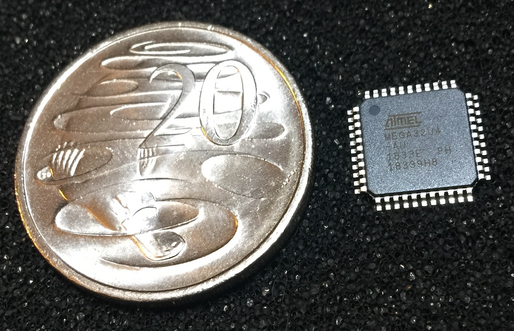
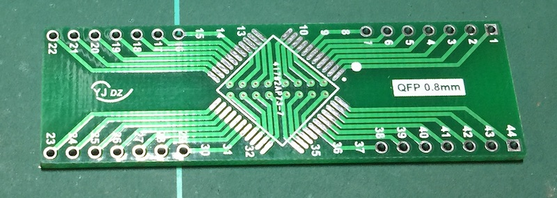
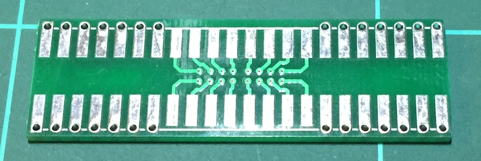
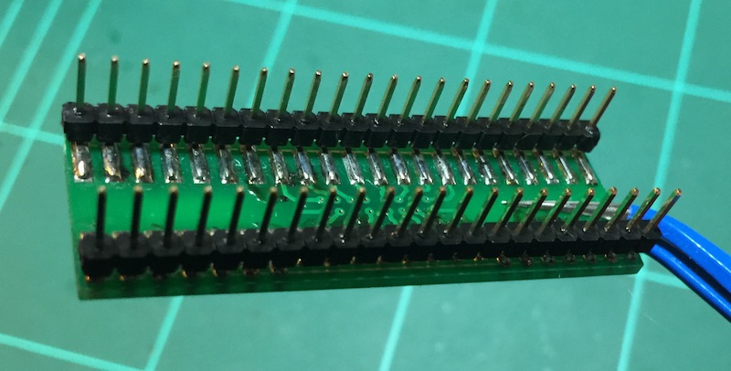
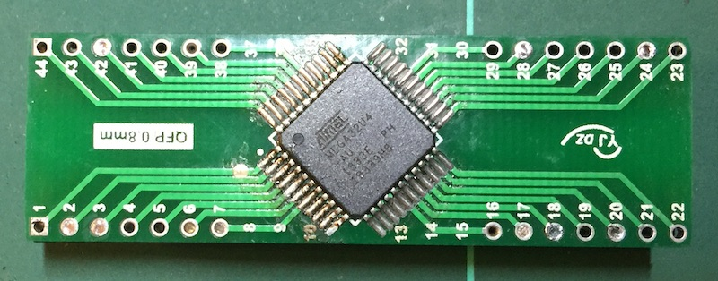
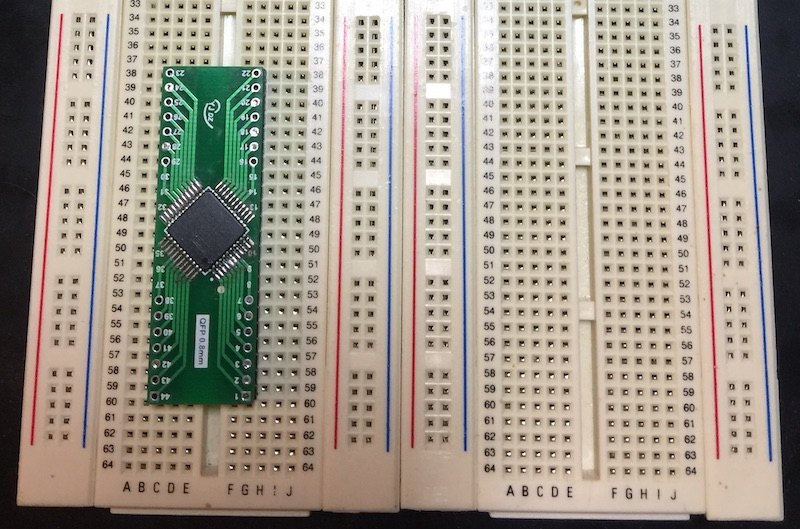

> **TL;DR** Surface mount soldering was not as hard as anticipated.

I've been tinkering with DIY electronics and mechanical keyboards for many
years. And have finally decided to design and manufacture my own keyboard
layout and PCB.

The brains or **MCU**micro-controller unit of the keyboard will be
the **ATmega32U4**, which is also used in
[Arduino Leonado](https://www.arduino.cc/en/Main/Arduino_BoardLeonardo) and
[Teensy 2.0](https://www.pjrc.com/store/teensy.html) boards.

> The ATmega32U4 comes in a TQFP-44 lead package. Is 10x10x1mm with 0.8mm pitch
> leads.

The keyboard schematic will be based largely on the Teensy 2.0, without the
voltage regulator and LED.

Before getting too far into PCB design however, I wanted to prototype the
circuit on a breadboard, with a small 4x4 key/switch matrix. So onto the next
phase...

### Soldering a TQFP-44 package MCU onto a breakout board

To make the MCU breadboard friendly we can solder it to a breakout board. I
picked up some _cheap-as-chips_tm TQFP-44 breakout boards from ebay,
do you notice the problem with them?

> top

> bottom

Pins 8 to 15 and 30 to 37 don't have through hole solder pads like the rest.
So lesson learned, pay extra attention to photos when purchasing these things
on ebay.

Fortunately right angle male headers can be soldered directly
onto the pads.

Soldering the mcu involved the following steps:

- Place mcu with a pair of tweezers. Align the mcu so the dark circle is
  closest to the white dot on the board.
- Hold mcu in place with a pencil or whatever you have handy, apply rosin to a
  corner pin and solder.

  
    (This tacks the mcu in place and allows you to re-solder if alignment needs
    fixing)
  

- Apply rosin to all pins on the opposite side to the one you tacked.
- In one continuous motion apply the soldering tip and solder, while dragging
  across each of the pins.

  (This is where the rosin really helps.)

- Repeat for the remaining sides and pins.

If any pins have bridged or didn't solder correctly, you can re-drag the
soldering tip over affected pins to fix.

> Success!

Next post we will wire up a USB-C port, 16Mhz crystal and supporting resistors
and capacitors.
