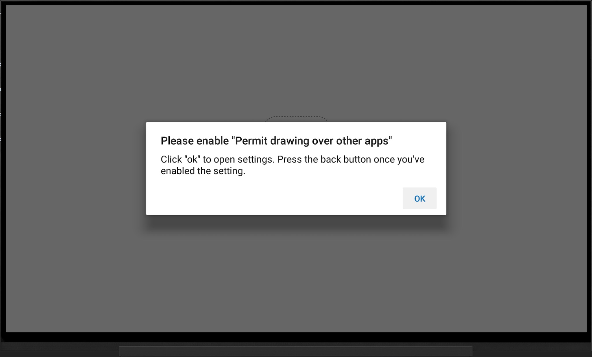

Recently I've been experimenting with React Native, Android TV, and the
[Expo](https://expo.io/) platform. This has been a mostly pleasant experience,
and anyone wanting to get into React Native, I'd highly recommand **Expo**.
The journey has not been without some initial roadblocks however, one of
which I'm documenting here...

## The problem

In the interest of saving my future self and other experimentors time and
sanity, I thought it prudent to document how to solve a frustrating error when
first starting out with **Expo** and the **Android simulator**.

When first loading your application in the simulator you will be greeted with a
message overlay _Please enable "Permit drawing over other apps"_. After
which Expo will shut down without running your application.



## The solution

The android debugging console (adb) allows among other things, to grant and
revoke permissions. For example, to grant a permission you run:

```bash
adb shell pm grant package.uri permission.uri
```

Since we are running our **Expo** based React Native application via
`expo start`, our application is hosted from within an expo package. We can
find this by listing packages and grepping:

```bash
adb shell pm list packages -f | grep expo
```

Which should return something like:

> package:/data/app/host.exp.exponent-1/base.apk=host.exp.exponent

So our package.uri is:
**_host.exp.exponent_**

I also know from much frantic googling that the permission.uri is:
**_android.permission.SYSTEM_ALERT_WINDOW_**

So our final command will be:

```bash
adb shell pm grant \
  host.exp.exponent \
  android.permission.SYSTEM_ALERT_WINDOW
```

I hope this saves you some time and frustration.
